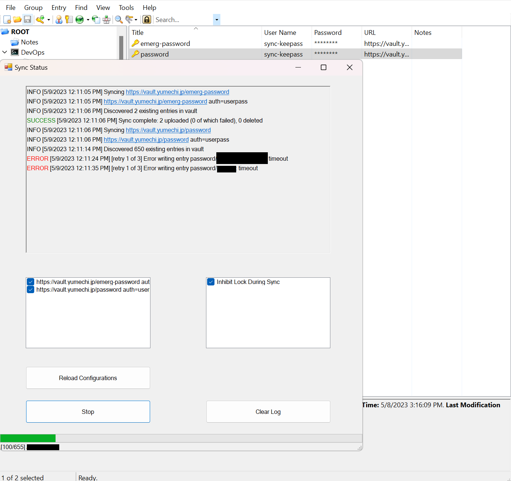

# KeepassVaultSync

Keepass v2.x plugin for syncing password entries to Hashicorp Vault.

## Usage

### Creating Sync Config Entry

To create a sync config, create a group called "Vault Sync" (case insensitive)
in the root of your database.

Then follow these steps:

1. In the URL field, enter the URL of the vault. Leave empty if you want the
   plugin to read from VAULT_ADDR environment variable.
2. If you want to use userpass authentication, enter the username and password
   in the username and password fields. if you want to use token authentication,
   leave the username empty and enter the token in the password field.
   Leave both empty to read from VAULT_TOKEN or ~/.vault-token.
3. In the Title field put the mount point of the vault KV store
   (currently only V1 is supported).
4. If you only want to sync items with specific tags, put each of the tag you want
   to include in the Tags field.
5. If you want to blacklist or whitelist certain paths, put each of the blacklist
   or whitelist regex in "path_regex_blacklist" or "path_regex_whitelist" string field.
   Seperate entries with a new line.
   Vault sync config themselves are always excluded from syncing.
6. If you want to delete orphan entries already in vault, add a "delete_orphans" string
   field with a non-empty value.
7. If you want verbose logging, add a "verbose" string field with a non-empty value.

### Initiating Sync

Go to `Tools -> KeepassVaultSync -> Open Sync Panel` and press `Start` to start.
You can interrupt the sync at any time.

## Building

On Windows, download the latest Keepass 2.x portable zip and unzip at `Keepass/`.

Build the project in release and the statically-linked plugin will be at
`bin/Release/KeepassVaultSync-packed.dll`
and automatically copied to `Keepass/Plugins/KeePassVaultSync.dll`.

I use Rider as the IDE to build the project, but should work on Visual Studio as well.